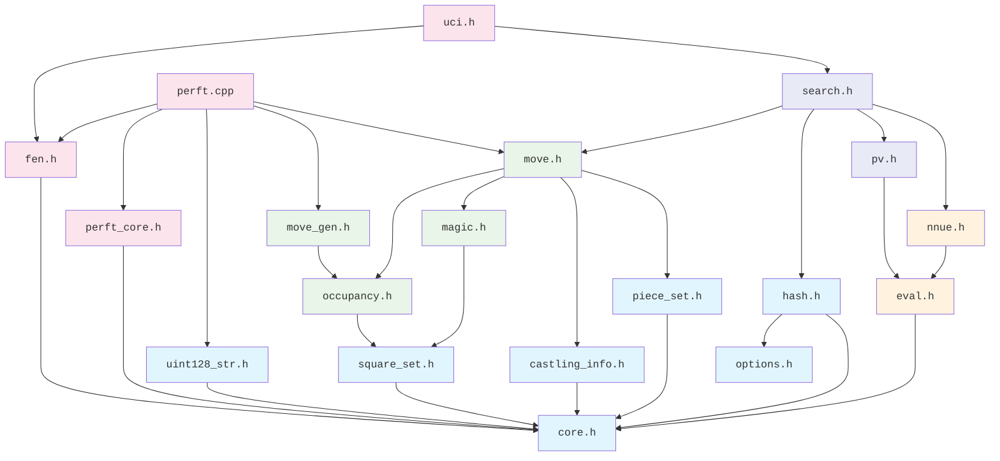
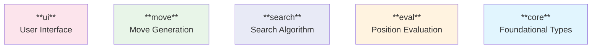

# Include File Dependencies

```mermaid

graph TD

    %% Core module - foundational types
    C[core.h]
        CI[castling_info.h]
        PS[piece_set.h]
        O[options.h]
        CU[uint128_str.h]

    %% Eval module - position evaluation
    E[eval.h]
        EN[nnue.h]

    %% FEN module - Forsyth-Edwards notation
    F[fen.h]

    %% Hash module - Zobrist hashing
    H[hash.h]

    %% Move module - Move generation
    M[move.h]
        MG[move_gen.h]
        %% Move Magic module - Sliding move generation
        MM[magic.h]
    MO[occupancy.h]

    %% Perft module - move generator testing
    P[perft.cpp]
    PC[perft_core.h]

    %% Search module
    PV[pv.h]
    S[search.h]

    SS[square_set.h]

    %% UCI module - universal chess ui
    U[uci.h]

    %% The following are include dependencies between the above modules.
    %% The order is chosen to be able to render a planar graph, without crossing edges.
    %% Transitive dependencies are generally omitted for the graph.
    U --> F
    U --> S
    F --> C
    P --> M
    P --> PC
    P ---> MG
    P ----> CU
    S --> M
    PC ----> C
    CU --> C
    MG --> MO
    M --> MO
    MO --> SS
    M --> MM
    SS --> C
    S --> EN
    S --> H
    S --> PV
    PV ---> E
    EN --> E
    P --> F
    M --> CI
    M ---> PS
    MM ---> SS
    CI --> C
    PS ---> C
    H --> O
    O ~~~ C
    H --> C
    E --> C

    %% Styling
    classDef core fill:#e1f5fe,font-family:monospace
    classDef move fill:#e8f5e8,font-family:monospace
    classDef eval fill:#fff3e0,font-family:monospace
    classDef ui fill:#fce4ec,font-family:monospace
    classDef perft fill:#f3e5f5,font-family:monospace
    classDef search fill:#e8eaf6,font-family:monospace

    class C,PS,CI,SS,H,O,CU core
    class MM,MO,MG,M move
    class E,EN eval
    class S,PV search
    class F,U,P,PC ui
```

```mermaid

graph LR
    ui[**ui**
    User Interface
    ]
    move[**move**
    Move Generation
    ]
    eval[**eval**
    Position Evaluation
    ]
    search[**search**
    Search Algorithm
    ]
    core[**core**
    Foundational Types
    ]

    ui ~~~ move ~~~ search ~~~ eval ~~~ core

    %% Styling
    style core fill:#e1f5fe
    style eval fill:#fff3e0
    style move fill:#e8f5e8
    style search fill:#e8eaf6
    style ui fill:#fce4ec

```