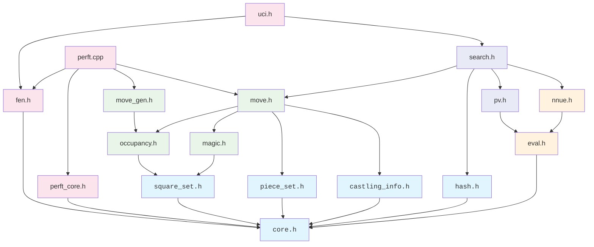

# Include File Dependencies

```mermaid

graph TD

%% Unknown module for occupancy.h referenced from move_gen.h
%% Unknown module for occupancy.h referenced from move.h
%% Unknown module for options.h referenced from hash.h
%% Unknown module for uint128_t.h referenced from perft_core.h
%% Unknown module for options.h referenced from perft.cpp


    %% Core module - foundational types
    C[core.h]
        CI[castling_info.h]
        PS[piece_set.h]

    %% Eval module - position evaluation
    E[eval.h]
        EN[nnue.h]

    %% FEN module - Forsyth-Edwards notation
    F[fen.h]

    %% Hash module - Zobrist hashing
    H[hash.h]

    %% Move module - Move generation
    M[move.h]
        MG[move_gen.h]
        %% Move Magic module - Sliding move generation
        MM[magic.h]
    MO[occupancy.h]

    %% Perft module - move generator testing
    P[perft.cpp]
    PC[perft_core.h]

    %% Search module
    PV[pv.h]
    S[search.h]

    SS[square_set.h]

    %% UCI module - universal chess interface
    U[uci.h]

    %% The following are include dependencies between the above modules.
    %% The order is chosen to be able to render a planar graph, without crossing edges.
    %% Transitive dependencies are generally omitted for the graph.
    U --> F
    U --> S
    F --> C
    P --> M
    P --> PC
    P --> MG
    S --> M
    PC --> C
    MG --> MO
    M --> MO
    MO --> SS
    M --> MM
    SS --> C
    S --> EN
    S --> H
    S --> PV
    PV --> E
    P --> F
    M --> CI
    M --> PS
    MM --> SS
    PS --> C
    CI --> C
    H --> C
    E --> C
    EN --> E

    %% Styling
    classDef core fill:#e1f5fe,font-family:monospace
    classDef move fill:#e8f5e8
    classDef eval fill:#fff3e0
    classDef interface fill:#fce4ec
    classDef perft fill:#f3e5f5
    classDef search fill:#e8eaf6

    class C,PS,CI,SS,H core
    class MM,MO,MG,M move
    class E,EN eval
    class S,PV search
    class F,U,P,PC interface
```