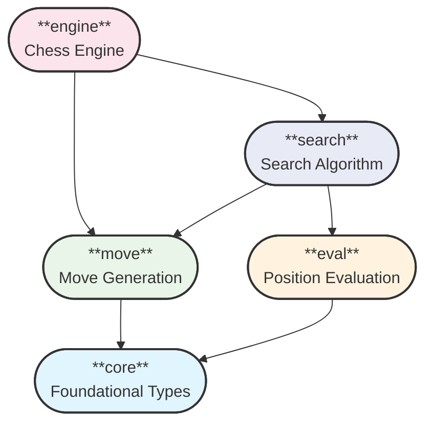
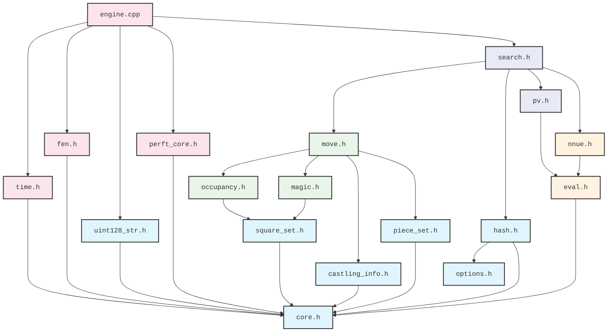

# Modular Architecture



## File Organization

The file organization represents the module structure.
```
src/
├── core/              - Core chess types and utilities
│   ├── hash/              - Zobrist Hashing
│   └── square_set/        - Bitboard operations
├── engine/             - UCI Chess Engine
│   ├── fen/               - FEN position parsing
│   └── perft/             - Performance testing
├── eval/              - Position evaluation
│   └── nnue/              - Neural network evaluation
├── move/              - Move generation and representation
│   └── magic/             - Magic bitboard generation
└── search/            - Search algorithms
```

## Include Dependencies
The graph below shows dependencies of the public APIs of the chess engine. Transitive dependencies
are omited for clarity. The `check-arch.sh` script verifies that all actual dependencies are
included here, and is part of the `make build` target. Keep the dependency graph planar when making
changes.


