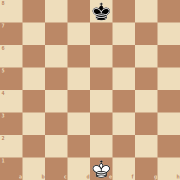
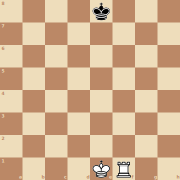
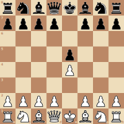

# Implementing Perft

This document describes implementation aspects for the `perft` program, from the most basic version
to optimized versions used for computing results for greater depths.

## The Basics

A basic version can be written in just a dozen or so lines of C++:

```cpp
    unsigned long long perft(Position& position, unsigned depth) {
        if (depth == 0) return 1;

        auto nodes = 0;
        for (auto move : allLegalMovesAndCaptures(position))
            nodes += perft(applyMove(position, move), depth - 1);

        return nodes;
    }
```

This assumes a `Position` type representing a chess position including side to move, castling rights
and en passant, an `allLegalMovesAndCaptures` function returning an iterable list of possible moves,
as well as an `applyMove` function producing a new position with the move applied.

## The Quest

While that's all that is needed for basic correctness testing, even at a modest depth of 6 or 7 half
moves, the run times become so large that they pose a challenge to answer questions about the number
of positions after 10 or more moves. See https://www.chessprogramming.org/Perft_Results for some
known results. The remainder of this documents describes methods for speeding up the `perft` program
to more efficiently compute results at larger depths. None of this is helpful for making a stronger
chess engine -- this is an unrelated endeavor.

## Optimization: Just Count at the Bottom

At depth 1, we don't need to actually make all the moves, just knowing the number is sufficient. By
implementing an optimized version of move generation that only determines the number of moves, the
following single line addition to `perft` gives a 7x speedup.

```cpp
    unsigned long long perft(Position& position, unsigned depth) {
        if (depth == 0) return 1;
        if (depth == 1) return countLegalMovesAndCaptures(position);

        ...
    }
```

## Optimization: Incremental Search State Updates

By introducing a SearchState struct that maintains information about the position and does
incremental updates instead of recomputing at each position gains a bit of incremental performance.

```cpp
    struct SearchState {
        Occupancy occupancy;
        SquareSet pawns;
        Turn turn;
        Square kingSquare;
        bool inCheck;
        SquareSet pinned;
    }
```

The update loop for the level immediately above the leaf level (with depth 2 remaining) is now as
follows.

```cpp
    SearchState theirs = ...;
    forAllLegalMovesAndCaptures(board, ours, [&](Board& board, MoveWithPieces mwp) {
        auto delta = MovesTable::occupancyDelta(mwp.move);
        theirs.occupancy = !(ours.occupancy ^ delta);
        theirs.turn = applyMove(ours.turn, mwp);

        theirs.pawns = initialPawns - SquareSet{mwp.move.to};
        if (mwp.move.kind == MoveKind::En_Passant)
            theirs.pawns = find(board, theirPawn);

        theirs.inCheck = isAttacked(board, theirs.kingSquare, theirs.occupancy);
        theirs.pinned = pinnedPieces(board, theirs.occupancy, theirs.kingSquare);

        nodes += countLegalMovesAndCaptures(board, theirs);
    });
```

## Caching: Hashing & Counting Require 128 Bits

Many move orders lead to the same position, so it is advantageous to cache (memoize) previously
computed results. For example, the opening 1. e4 e5 2. c3 results in the very same position as 1.
c3 e5 2. e4. One significant difference with storing evaluations for normal game play is that we
cannot reuse results from deeper depths as they would search fewer nodes.

Similarly, consequences of hash collisions are more severe, as this would lead to returning an
invalid number of nodes, possibly ruining the results of hours of computation. By the
[birthday paradox](https://en.wikipedia.org/wiki/Birthday_problem), the expected number of random
probes before the first collision in a *b*-bit hash is approximately $\sqrt{\pi/2} \cdot 2^{b/2}$.
For a 64-bit hash that threshold is only about $1.25 \cdot 2^{32} \approx 5$ billion — easily
exceeded in a deep perft run. With a 128-bit hash the threshold rises to $\sim 2^{64}$, making
accidental collisions practically impossible. For this reason use 128-bit hashes, in addition to
either checking for matching levels or incorporating the level in the hash. In practice there is no
significant overhead to using 128-bit hashes.

Until here, without caching or multi-threading, search speeds will generally be below 1B/sec even on
very fast systems, so there is no real danger of overflowing a 64-bit unsigned count. However, with
caching this changes, and for some scenarios with few pieces on the board very deep perft
calculations become fast and will overflow 64-bit counters. For perft from the starting position
this happens at depth 14. So, again, use 128-bit counters when computing deep perft results is a
goal.

## Caching: Going Deep

An interesting consequence of caching is how well it works for positions with very few pieces. With
only the two kings remaining, the total number of distinct positions is surprisingly small. Kings
may not occupy adjacent squares, so the number of valid (white king, black king) placements is:

$$4 \times (63 - 3) + 24 \times (63 - 5) + 36 \times (63 - 8)
  = 240 + 1{,}392 + 1{,}980 = 3{,}612$$

where the three terms correspond to the 4 corner squares (3 neighbors), the 24 non-corner edge
squares (5 neighbors), and the 36 interior squares (8 neighbors). Multiplying by 2 for side to move
gives only **7,224** legal positions — tiny enough that a cache warms up almost immediately, making
very deep perft calculations fast and prone to overflowing 64-bit and even 128-bit counters. The two
kings position below overflows a 128 bit counter at depth 47 after just half a second of
computation.

| Two Kings                           | Depth | Total Nodes |
|-------------------------------------|------:|------------:|
|  | 5<br>15<br>46 |$7.92 \times 10^{3}$<br>$1.87 \times 10^{12}$<br>$1.38 \times 10^{38}$|

| Two Kings and Rook                  | Depth | Total Nodes |
|-------------------------------------|------:|-------------|
|  | 5<br>15<br>38 |$7.22 \times 10^{4}$<br>$1.42 \times 10^{15}$<br>$3.28 \times 10^{38}$|

## Caching: Things that Don't Work?

From the starting position, it is possible to reach many positions that are equivalent, except for
the board being flipped, the black and white colors being interchanged, both for the pieces on the
board and the active player. One example is e3 e5 e4, which leads to a position that is a mirror of
e4 e5, except with black being the active payer.

An experiment trying this out was unsuccessful, but this may be worth revisiting at some point.
There would be a similar story with flipping positions horizontally, assuming there are no more
castling rights.

| e3 e5 e4                           | e4 e5                       |
|------------------------------------|-----------------------------|
|  |   |


## Performance Results

The following timing results for perft at various depth for the start position were obtained on a
2019 iMac with a 3.6 GHz 8-Core Intel Core i9 CPU. They're really meant as an illustration of the
impact of the various optimizations. YMMV.

A few notes: at very low depth startup times dominate on macOS. Large memory allocations such as
required for caching have a particularly large impact.

| Implementation | Depth 4 | Depth 5 | Depth 6 | Depth 7 | Depth 8 | Nodes/Sec |
|----------------|--------:|--------:|--------:|--------:|--------:|----------:|
| Basic          |    0.01 |    0.22 |    5.47 |  143.17 |       - |      22 M |
| Count at Bottom|    0.00 |    0.03 |    0.72 |   18.63 |       - |     174 M |
| SearchState    |    0.39 |    0.41 |    0.87 |   12.61 |  351.89 |     242 M |
| Caching (2 GB) |    0.78 |    0.80 |    1.06 |    4.28 |   49.16 |   1,729 M |
| Multi-threading|    0.77 |    0.80 |    1.07 |    1.30 |    7.51 |  11,318 M |
| Stockfish 16.1 |    0.29 |    0.31 |    0.89 |   15.87 |  450.57 |     189 M |
